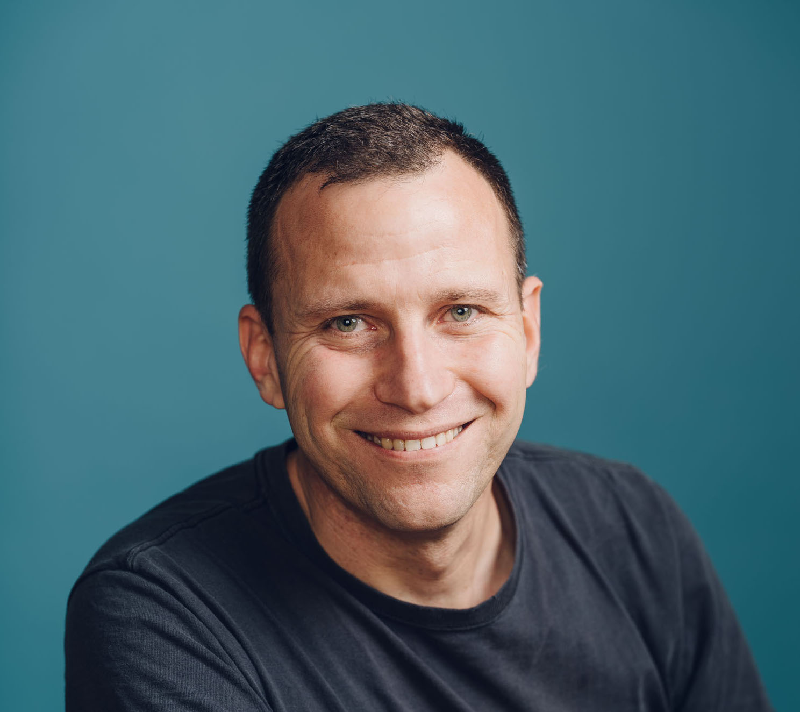

Product Builder
---------------
**25 years making enterprise complexity work for the broader economy.**

Engineering, product, and design — startups, unicorns, Fortune 500. Now: agentic AI as the substrate.

> **One thesis:** AI orchestration shouldn't only work for FAANG. I build living-organism systems — autonomous, self-healing, multi-agent — using coding agents as the substrate.

Bio
---
Bay Area–based, with U.S., Israeli, and EU citizenship.

25 years across engineering, product, and design — startups, unicorns, Fortune 500. Co-founded [eDealya](https://www.crunchbase.com/organization/edealya) (raised $1M from [Nielsen incubator](https://www.nielsen.com), acquired). Scaled design at [Gainsight](https://www.gainsight.com) (PE-held unicorn, 25+ team, Pulse keynote). At [SugarCRM](https://www.sugarcrm.com), drove the shift from reactive system of record → proactive system of guidance: self-healing data via LLMs, agentic AI for precision selling.

Earlier: engineering at [Intel (NASDAQ: INTC)](https://www.intel.com); product and engineering teams at [Amdocs (NASDAQ: DOX)](https://www.amdocs.com), delivering for clients like [AT&T](https://www.att.com); product roles at [Totango](https://www.totango.com), [Degreed](https://www.degreed.com), and [Grovo](https://www.grovo.com). Foundation honed as an officer in an elite Israeli military unit — training equivalent to West Point officer training, completed with honors.

Shipped at Scale
----------------

- **eDealya** — Co-founded, raised $1M from Nielsen incubator, **acqui-hired**.
- **Gainsight** — Scaled product design org to 25+; owned 4-year arc through hyper-growth; [Moscone 5K+ people keynote](https://www.youtube.com/watch?v=WYp0qn1kThg).
- **Degreed** — Shipped recommender + skill-graph used by Fortune 500 L&D orgs.
- **SugarCRM** — Drove FY27 reposition for a 700-person org; system of record → system of guidance.

Currently Building
------------------
**System of Guidance · In Production · 6+ months · Ships Nightly**

For the past 6+ months I've run my "system of guidance" thesis as a 24/7 production deployment — autonomous multi-agent orchestration, self-healing data, behavioral feedback loops on edge hardware. Same architecture I drove into SugarCRM's FY27 strategy, validated by running it on myself first. Coding agents dispatch and review their own GitHub work. The system catches its own failures, self-heals, and surfaces the right action at the right moment.

Production architecture I'd bring to customer deployments — built end-to-end, shipping nightly, battle-tested on a real workload before I bring it to yours.

Looking For
-----------
Field roles where the goal is bringing agentic systems into production for enterprise customers — **manufacturing, healthcare, finance, logistics**. Not generic AI features. Living-organism orchestration, embedded with the customer, shipped in their environment.

Timeline
--------
Output, not titles. What I shipped, who it shipped to, what changed.

- **Aug 2025 – Present:** _VP Product Strategy & AI_, [SugarCRM](https://www.sugarcrm.com), Remote · 700-person org
  Drove FY27 reposition: system of record → system of guidance. Repositioned a 700-person org toward AI-first product strategy. Covered every product VP role through transitions. Self-healing data via LLMs; agentic AI for precision selling.
- **Mar 2025 – Aug 2025:** _Consultant_, Foldspace, Sunnyvale, USA
  AI product strategy and orchestration advisory.
- **May 2021 – Mar 2025:** _Head of Product Design_, [Gainsight](https://www.gainsight.com), San Francisco, USA
  Scaled product design org to 25+ at PE-held unicorn. [Moscone 5K+ people keynote](https://www.youtube.com/watch?v=WYp0qn1kThg).
- **Mar 2020 – May 2021:** _Technical Product Manager_, [ZaiNar](https://www.zainar.com), Silicon Valley, USA
  RF + edge hardware product. Sub-nanosecond timing systems, robotic indoor location testing ([filed and registered patent](https://patents.google.com/patent/US11785482B1/)).
- **Mar 2018 – Mar 2020:** _Director of Product_, [Degreed](https://www.degreed.com), San Francisco, USA
  Owned core learning experience for the enterprise upskilling platform. Shipped recommender + skill-graph surfaces used by Fortune 500 L&D orgs.
- **Jan 2017 – Mar 2018:** _Senior Product Manager_, [Grovo](https://www.grovo.com), New York, USA
  Microlearning platform. Reframed authoring tooling so SMB teams could ship custom training without a course-design team.
- **Aug 2013 – Jan 2017:** _Senior Product Manager (Mobile)_, [Totango](https://www.totango.com), Silicon Valley, USA
  Built first-generation mobile customer-success surfaces. Early signal-driven workflows — precursor to today's "system of guidance" thesis.
- **Jan 2011 – Aug 2013:** _Co-founder & SVP Product_, [eDealya](https://www.crunchbase.com/organization/edealya), Tel Aviv → Silicon Valley
  Co-founded ad-tech orchestration company. Raised $1M from Nielsen incubator. Led from Tel Aviv to Silicon Valley. Acqui-hired.
- **Oct 2005 – Jan 2011:** _Product Management & Web Solutions_, [Amdocs (NASDAQ: DOX)](https://www.amdocs.com), Tel Aviv, Israel
  Carrier-grade web and product solutions for Tier-1 telcos including [AT&T](https://www.att.com). Enterprise complexity, productized.
- **Aug 2002 – Oct 2005:** _Yield Analysis Engineer_, [Intel Corporation (NASDAQ: INTC)](https://www.intel.com), Israel
  Silicon yield analysis at fab scale. Where the data-driven instinct started.
- **1996 – 1999:** _Officer (Special Unit)_, Israel Defense Forces, Israel
  Officer training equivalent to West Point, completed with honors. Where leadership under uncertainty got drilled in.

Education & Recognition
-----------------------
- B.Sc. Information Technology Engineering — _Magna Cum Laude_
- MBA · [Ben-Gurion University](https://in.bgu.ac.il/en/)
- Specialized entrepreneurial program · [Merage School of Business, UC Irvine](https://merage.uci.edu)
- [U.S. patent](https://patents.google.com/patent/US11785482B1/) — robotic indoor location testing

Contact
-------
- [ophirsw@gmail.com](mailto:ophirsw@gmail.com)
- [LinkedIn](https://www.linkedin.com/in/ophirsw)
- [GitHub @ophirsw](https://github.com/ophirsw)
- Based: San Francisco Bay Area
